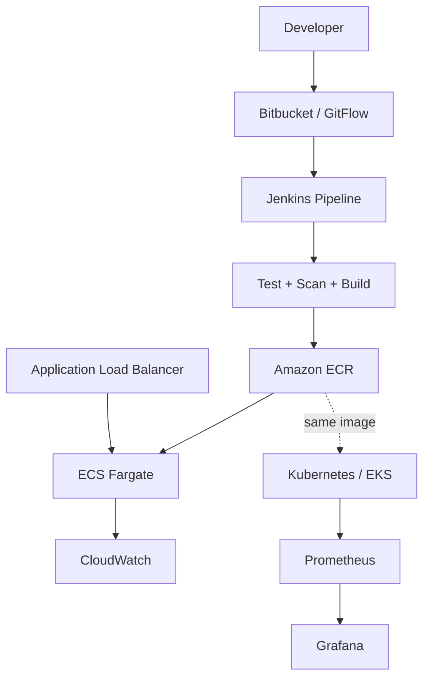

# CampusPulse Cloud Platform

Proyecto de portafolio DevOps/Cloud inspirado en una plataforma SaaS para educación superior.

CampusPulse expone una API de participación académica con datos sintéticos. El valor principal del repositorio no es la lógica de negocio: es demostrar cómo una aplicación se construye, prueba, protege, publica, despliega, monitorea y opera de manera repetible.

## Objetivo profesional

Crear evidencia verificable para un puesto de Cloud Engineer mediante:

- Terraform modular para AWS.
- Ansible para configuración repetible de Jenkins.
- Jenkins Pipeline como código.
- Bitbucket + GitFlow + pull requests.
- Python y Bash para automatización.
- Docker para empaquetado reproducible.
- Amazon ECR y ECS Fargate para producción.
- Kubernetes para portabilidad; EKS como fase avanzada y efímera.
- Prometheus, Grafana y CloudWatch para métricas, paneles, logs y alarmas.
- Runbooks, ADR, diagramas y matriz de competencias.

## Arquitectura resumida



## Inicio local

Requisitos: Docker Engine con Compose v2 y Git.

```bash
cp .env.example .env
docker compose up --build -d
curl http://localhost:8000/healthz
curl http://localhost:8000/api/v1/engagement/summary
```

Servicios:

| Servicio | URL | Uso |
|---|---|---|
| CampusPulse API | http://localhost:8000 | Aplicación y Swagger en `/docs` |
| Prometheus | http://localhost:9090 | Consulta de métricas |
| Grafana | http://localhost:3000 | Dashboard; credenciales desde `.env` |

## Pruebas sin Docker

```bash
python3 -m venv .venv
source .venv/bin/activate
pip install -e '.[dev]'
pytest -q
ruff check .
bandit -r app
```

## Despliegues

- `infra/terraform/environments/dev`: entorno principal AWS en ECS Fargate.
- `platform/kubernetes/base`: manifiestos portables para Kubernetes.
- `automation/ansible`: Jenkins sobre Ubuntu, administrado mediante Ansible.
- `Jenkinsfile`: pipeline principal CI/CD.

El proyecto se implementa siguiendo [docs/roadmap.md](docs/roadmap.md). No ejecutes `terraform apply` hasta revisar los recursos y el apartado de costos.

## Estrategia de ramas

- `main`: versión estable y candidata a producción.
- `develop`: integración del siguiente release.
- `feature/CAMPUS-###-descripcion`: cambios individuales.
- `release/x.y.z`: estabilización.
- `hotfix/x.y.z`: correcciones urgentes.

## Evidencias para entrevista

Al terminar, el repositorio deberá incluir:

- Captura del pipeline exitoso.
- URL o video corto del servicio en ECS.
- Dashboard de Grafana con tráfico, errores y latencia.
- Evidencia de autoscaling o de una alarma activada.
- Pull request siguiendo GitFlow.
- Salida de `terraform plan`, pruebas y análisis de seguridad.
- Runbook de despliegue, rollback e incidente.
- Diagrama final y explicación de decisiones.

## Seguridad y costos

- No guardes credenciales, estados de Terraform ni secretos en Git.
- Jenkins usará credenciales administradas y un rol IAM, no claves embebidas.
- El servicio de aplicación corre como usuario no root.
- EKS se crea únicamente durante su demostración y se destruye el mismo día.
- Ejecuta siempre `terraform destroy` al terminar cada laboratorio cloud.

