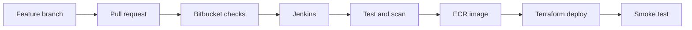
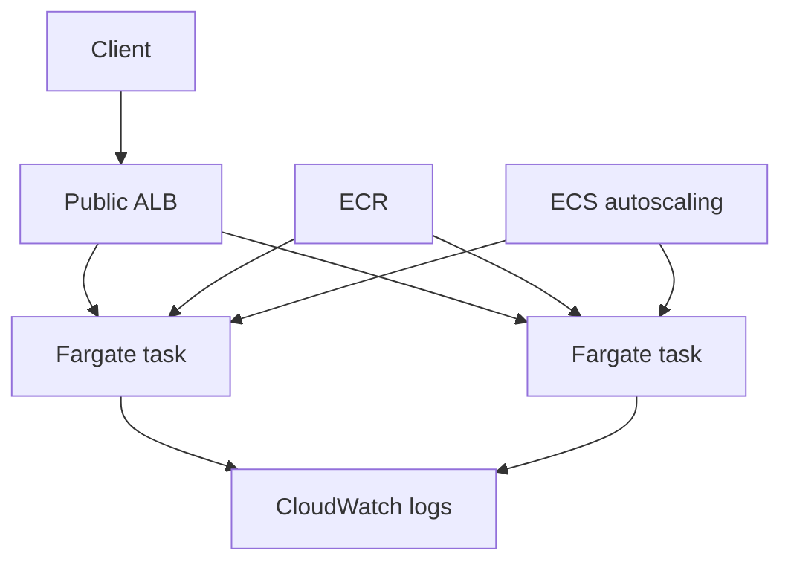
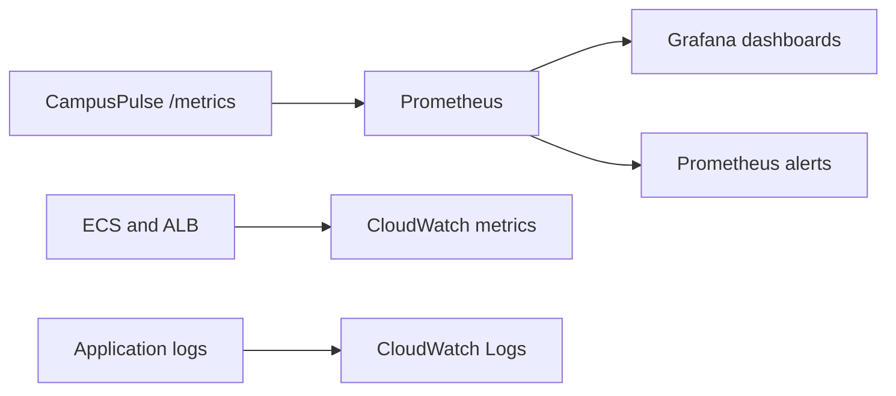

# Arquitectura

## Flujo de entrega

## Runtime principal en AWS

El entorno de laboratorio coloca las tareas en subredes públicas con reglas que solo permiten tráfico desde el ALB. Esta decisión evita el costo de un NAT Gateway y es apropiada para un entorno efímero de portafolio. Una evolución de producción movería las tareas a subredes privadas y agregaría VPC endpoints o salida administrada.

## Ruta de observabilidad

Las métricas de aplicación siguen las señales esenciales para un servicio HTTP: volumen, errores, latencia y solicitudes en curso. CloudWatch cubre la infraestructura AWS; Prometheus/Grafana demuestra observabilidad cloud-native y se reutiliza en Kubernetes.

## Kubernetes

La imagen de ECR se despliega sin recompilarla. Kubernetes agrega:

- `Deployment` con dos réplicas.
- `Service` interno.
- Liveness y readiness probes.
- Requests, limits y HPA.
- Pod Disruption Budget.
- Contexto no-root, capacidades eliminadas y filesystem de solo lectura.
- `ServiceMonitor` para Prometheus Operator.

## Decisiones principales

| Decisión | Razón | Trade-off |
|---|---|---|
| ECS Fargate como runtime principal | Menor carga operativa y ajuste directo a la vacante | Menos control del host |
| EKS solo como fase efímera | Demuestra Kubernetes sin mantener costo permanente | No es el entorno principal |
| Imagen etiquetada con SHA | Trazabilidad y rollback determinista | Requiere política de limpieza |
| Jenkins como pipeline principal | Alineación directa con la vacante y pipeline-as-code | Se debe operar el controlador |
| Bitbucket para SCM y PR | Alineación directa con la vacante | GitHub público puede mantenerse como espejo |
| Prometheus/Grafana + CloudWatch | Demuestra señales de aplicación e infraestructura | Dos rutas de observabilidad |
| Datos sintéticos en memoria | Elimina riesgos de privacidad y centra el ejercicio en Cloud/DevOps | No demuestra persistencia aún |

## Referencias técnicas

- [AWS Fargate para Amazon ECS](https://docs.aws.amazon.com/AmazonECS/latest/developerguide/AWS_Fargate.html)
- [Balanceo de carga para servicios ECS](https://docs.aws.amazon.com/AmazonECS/latest/developerguide/service-load-balancing.html)
- [Jenkins Pipeline](https://www.jenkins.io/doc/book/pipeline/)
- [Webhooks de Bitbucket Cloud](https://support.atlassian.com/bitbucket-cloud/docs/manage-webhooks/)
- [Instrumentación con Prometheus](https://prometheus.io/docs/practices/instrumentation/)
- [Aprovisionamiento de Grafana](https://grafana.com/docs/grafana/latest/administration/provisioning/)
- [Guía de estilo de Terraform](https://developer.hashicorp.com/terraform/language/style)
- [Roles de Ansible](https://docs.ansible.com/projects/ansible/latest/playbook_guide/playbooks_reuse_roles.html)

